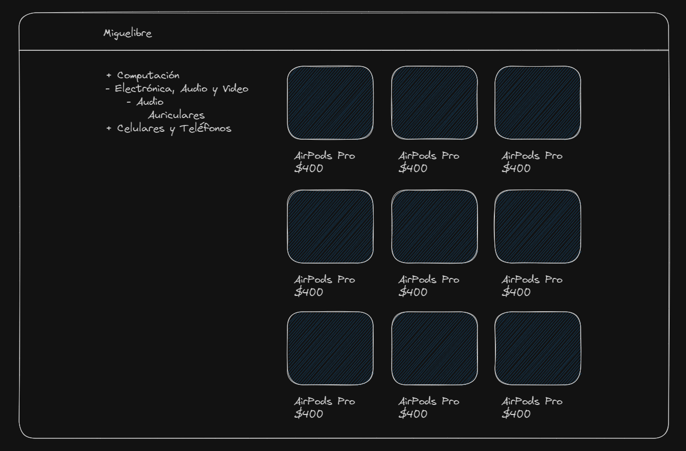

# [Resolution of the challenge in Goncy's migrado-libre project.](https://github.com/goncy/interview-challenges/tree/main/proyectos-live/migrado-libre)

## Challenge

Don Miguel has been selling on Mercado Libre for 10 years, but he faces a unique challenge; he suffers from [xanthophobia](https://www.autopista.es/planeta2030/es-xantofobia_269191_102.html#:~:text=La%20xantofobia%20se%20refiere%20al,sea%20o%20contenga%20este%20tono.) (fear of the color yellow), which causes him great stress when navigating the Mercado Libre website.

His son Ángel, who is a programmer, informed him that Mercado Libre offers an open API that allows product searches with specific parameters. Therefore, Don Miguel could create his own website to showcase his products. However, Ángel is relatively new to frontend development and isn't sure how to proceed.

Ángel heard that Next.js, TypeScript, and Tailwindcss are powerful tools that can make the job easier. He has prepared this project for us to collaborate on.

## Resources

Ángel did some research and found that Miguel's store has a `Seller ID` of `179571326`. He also discovered that Mercado Libre's API includes an endpoint for searching a particular seller's products, with the endpoint being `https://api.mercadolibre.com/sites/MLA/search?seller_id=179571326`. Additionally, he mentioned that by accessing this endpoint from a web browser, you can view the response in JSON format along with some information. The rest of the API documentation is available [here](https://developers.mercadolibre.com.ar/es_ar/items-y-busquedas).

## Requirements

- [ ] Upon visiting the `/` route, we should see a grid-style list of all of Miguel's products.
- [ ] When visiting the `/[category_id]` route, we should see a list of products corresponding to that category.
- [ ] On all routes, there should be a menu on the left displaying available categories. Categories should be displayed in a tree-like structure, meaning that if a category has subcategories, they should appear as a submenu.
- [ ] Categories should start in a collapsed state, and clicking a `-` or `+` button should expand or collapse them individually.
- [ ] Categories should retain their expansion/collapse state when navigating between routes.
- [ ] Clicking on a category should navigate to the corresponding `/[category_id]` route.
- [ ] Clicking on a product should redirect us to the Mercado Libre page for that product.

## Example

> Note: The design is flexible, but it should be responsive.
